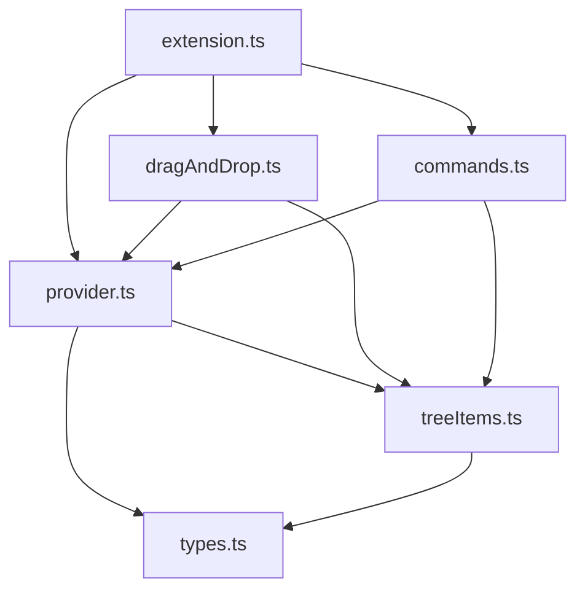
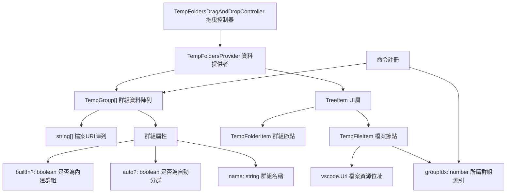

# VirtualTabs 開發指南

本文件提供 VirtualTabs VS Code 擴展的完整開發環境建置與開發流程說明。

---

## 🛠️ 開發環境建置

### 系統需求

* **Node.js** (建議 v16 以上)
* **VS Code** (v1.75.0 以上)
* **TypeScript** (已包含在 devDependencies 中)

### 開發環境設置步驟

#### 1. 專案初始化

```bash
# 複製專案並進入目錄
git clone https://github.com/winterdrive/virtual-tabs.git
cd virtual-tabs

# 安裝依賴套件
npm install
```

#### 2. 編譯 TypeScript

```bash
# 一次性編譯
npx tsc

# 或使用 npm script
npm run vscode:prepublish
```

#### 3. 開發模式啟動

有兩種方式可以啟動開發模式：

##### 方法 A：使用 VS Code 調試功能

1. 在 VS Code 中開啟專案目錄
2. 按 `F5` 或使用 Command Palette (`Cmd+Shift+P` / `Ctrl+Shift+P`)
3. 選擇 "Debug: Start Debugging"
4. 新的 Extension Development Host 視窗會開啟

##### 方法 B：使用命令行

```bash
# macOS/Linux
code --extensionDevelopmentPath=. --new-window

# Windows
code.cmd --extensionDevelopmentPath=. --new-window
```

#### 4. 即時開發與調試

##### 啟動自動編譯模式

```bash
# 啟動 TypeScript watch 模式，自動編譯變更
npx tsc --watch

# 或使用 VS Code 任務
# 按 Cmd+Shift+P → "Tasks: Run Task" → "tsc: watch - tsconfig.json"
```

#### 重新載入擴展

在 Extension Development Host 視窗中：

* 按 `Cmd+R` (macOS) 或 `Ctrl+R` (Windows/Linux) 重新載入
* 或使用 Command Palette → "Developer: Reload Window"

#### 5. 調試技巧

### 設置中斷點

* 在 TypeScript 源碼中直接設置中斷點
* F5 啟動調試模式後中斷點會生效

### 查看調試資訊

* 使用 `console.log()` 輸出到 Developer Console
* 查看 Output 面板 → "Extension Host" 頻道
* 使用 VS Code 的 Debug Console

### 測試擴展功能

1. 在 Extension Development Host 視窗中開啟一些檔案
2. 查看 Explorer 面板中的 "Virtual Tabs" 視圖
3. 測試各種功能（分群、拖拽、右鍵選單等）

---

## 🛠️ 技術配置詳情

### package.json 核心配置

```json
{
    "name": "virtual-tabs",
    "displayName": "VirtualTabs",
    "main": "./dist/extension.js",
    "engines": { "vscode": "^1.75.0" },
    "contributes": {
        "views": {
            "explorer": [{
                "id": "virtualTabsView",
                "name": "Virtual Tabs",
                "icon": "$(tab)"
            }]
        },
        "commands": [
            // 21 個註冊指令，包含群組管理、檔案操作、批次處理等
        ],
        "menus": {
            "view/item/context": [
                // 豐富的右鍵選單配置，支援不同 contextValue 的條件顯示
            ]
        }
    }
}
```

### TypeScript 編譯配置

```json
{
    "compilerOptions": {
        "target": "ES2020",
        "module": "commonjs",
        "outDir": "dist",
        "rootDir": "src",
        "strict": true,
        "types": ["node", "vscode"]
    }
}
```

### VS Code 開發環境配置

#### .vscode/launch.json

```json
{
    "configurations": [{
        "name": "Run Extension",
        "type": "extensionHost",
        "preLaunchTask": "vscode:prepublish",
        "outFiles": ["${workspaceFolder}/dist/**/*.js"]
    }]
}
```

#### .vscode/tasks.json

```json
{
    "tasks": [{
        "label": "vscode:prepublish",
        "command": "npm run vscode:prepublish",
        "group": { "kind": "build", "isDefault": true },
        "problemMatcher": ["$tsc"]
    }]
}
```

---

## 📁 專案結構說明

### 目錄總覽

```text
virtual-tabs/
├── .vscode/               # VS Code 配置檔案
│   ├── launch.json       # 調試配置（preLaunchTask: vscode:prepublish）
│   └── tasks.json        # 建置任務配置
├── dist/                 # TypeScript 編譯輸出目錄
├── assets/               # 圖示與截圖資源
│   ├── demo.png         # 功能展示截圖
│   └── virtualtabs_icon_*.png  # 擴充套件圖示
├── src/                  # TypeScript 源碼目錄
│   ├── extension.ts      # 擴充套件主程式（activate/deactivate）
│   ├── types.ts          # 資料結構定義（TempGroup）
│   ├── treeItems.ts      # TreeView 項目定義（TempFolderItem/TempFileItem）
│   ├── provider.ts       # TreeDataProvider 實作與群組管理邏輯
│   ├── dragAndDrop.ts    # 拖曳控制器（TreeDragAndDropController）
│   ├── commands.ts       # VS Code 指令註冊與實作
│   └── index.ts          # 模組匯出入口
├── package.json          # 擴充套件描述、指令與選單配置
├── tsconfig.json         # TypeScript 編譯設定
├── readme.md             # 使用與開發說明
├── DEVELOPMENT.md        # 詳細開發指南
└── LICENSE               # MIT 授權條款
```

### 模組職責說明

| 模組檔案             | 功能簡述                               | 主要類別/介面 |
| ---------------- | ---------------------------------- | ---------- |
| `extension.ts`   | 擴充套件生命週期管理，初始化 provider、拖曳控制器與指令註冊 | `activate()`, `deactivate()` |
| `provider.ts`    | 實作 `TreeDataProvider`，管理群組資料、檔案操作與 UI 更新 | `TempFoldersProvider` |
| `treeItems.ts`   | 定義 TreeView 項目類別，控制顯示行為與 contextValue | `TempFolderItem`, `TempFileItem` |
| `types.ts`       | 定義共用資料結構與介面                      | `TempGroup` |
| `dragAndDrop.ts` | 實作拖曳控制器，處理檔案拖曳至群組功能                | `TempFoldersDragAndDropController` |
| `commands.ts`    | 註冊並實作所有 VS Code 指令，包含群組管理與檔案操作     | `registerCommands()` |

### 核心資料流程

```mermaid
flowchart TD
    "Extension啟動" --> "初始化Provider"
    "初始化Provider" --> "載入workspaceState"
    "載入workspaceState" --> "建立內建群組"
    "建立內建群組" --> "註冊TreeView"
    "註冊TreeView" --> "註冊拖曳控制器"
    "註冊拖曳控制器" --> "註冊指令"
    
    "使用者操作" --> "指令執行"
    "指令執行" --> "更新群組資料"
    "更新群組資料" --> "儲存workspaceState"
    "儲存workspaceState" --> "觸發UI刷新"
```

---

## 🔧 常見開發問題

### Q: 編譯錯誤 "Cannot find module 'vscode'"

```bash
# 確保已安裝正確的 @types/vscode 版本
npm install --save-dev @types/vscode@^1.75.0
```

### Q: 擴展在 Extension Development Host 中沒有出現

* 檢查 `package.json` 中的 `main` 欄位是否指向正確的編譯檔案
* 確認 TypeScript 編譯無錯誤
* 查看 Developer Tools Console 是否有錯誤訊息

### Q: 修改程式碼後沒有反映變化

* 確認 TypeScript 已重新編譯 (檢查 `dist/` 目錄)
* 在 Extension Development Host 中重新載入視窗 (`Cmd+R`)

### Q: 拖拽功能不工作

* 確認 `dragAndDropController` 已正確註冊到 TreeView
* 檢查 `supportedTypes` 和 `dropMimeTypes` 配置
* 查看 Console 是否有拖拽相關錯誤

### Q: 指令沒有出現在 Command Palette 中

* 檢查 `package.json` 中的 `commands` 配置
* 確認指令已在 `commands.ts` 中正確註冊
* 重新載入 Extension Development Host

---

## 🔁 資料流與架構設計

### 模組互動圖



### 資料流簡介

1. `extension.ts` 啟動時初始化 `provider`、拖曳控制器與指令。
2. `provider` 載入已開啟檔案，依副檔名分群。
3. 使用者與 UI 互動（如點擊、拖曳、指令）將更新 `provider` 中的資料。
4. 群組資料更新後，自動儲存至 `workspaceState` 並觸發 UI 刷新。

### 資料結構概念圖



### 實際資料結構範例

存在於記憶體和 workspaceState 中的資料結構：

```json
const groups: TempGroup[] = [
    {
        name: "目前已開啟檔案",  // 群組名稱
        files: [
            "file:///c:/project/file1.ts",
            "file:///c:/project/file2.json"
        ],
        builtIn: true  // 這是內建群組
    },
    {
        name: "TypeScript 檔案",  // 自動分類的群組
        files: [
            "file:///c:/project/file1.ts",
            "file:///c:/project/file3.ts"
        ],
        auto: true  // 這是自動分群群組
    },
    {
        name: "我的自訂群組",  // 使用者自訂群組
        files: [
            "file:///c:/project/file1.ts",
            "file:///c:/project/file2.json"
        ]
        // 非內建也非自動
    }
];
```

### UI 顯示層轉換

`TempGroup` 資料會被轉換成 TreeView 項目供 VS Code 顯示：

```typescript
// 群組節點 (對應 TempGroup)
new TempFolderItem("TypeScript 檔案", 1, false)
    ├── new TempFileItem(Uri.file("file1.ts"), 1, false)  // 檔案節點，記錄群組索引
    └── new TempFileItem(Uri.file("file3.ts"), 1, false)  // 檔案節點，記錄群組索引
```

**轉換流程**：

1. `TempGroup[]` 資料 → `TempFoldersProvider.getChildren()`
2. → `TempFolderItem` (群組節點) + `TempFileItem[]` (檔案節點)
3. → VS Code TreeView 顯示

---

## 🚀 發布與部署

### 本地測試

1. 確保所有 TypeScript 編譯無錯誤
2. 在 Extension Development Host 中全面測試功能
3. 檢查 package.json 中的版本號和依賴

### 打包擴展

```bash
# 安裝 vsce (Visual Studio Code Extension manager)
npm install -g vsce

# 打包成 .vsix 檔案
vsce package

# 發布到 VS Code Marketplace
vsce publish
```

### 版本管理

```bash
# 更新版本號
npm version patch  # 修補版本 (0.0.1 → 0.0.2)
npm version minor  # 次版本 (0.0.1 → 0.1.0)
npm version major  # 主版本 (0.0.1 → 1.0.0)
```

---

## 🤝 貢獻指南

### 開發流程

1. Fork 專案並建立功能分支
2. 遵循現有的程式碼風格和架構
3. 添加適當的註釋和文件
4. 測試新功能或修復
5. 提交 Pull Request

### 程式碼風格

* 使用 TypeScript 嚴格模式
* 遵循現有的命名規範
* 保持註釋為繁體中文（如使用者指令需求）
* 適當使用 JSDoc 註釋

### 測試檢查清單

* [ ] TypeScript 編譯無錯誤
* [ ] 所有功能在 Extension Development Host 中正常運作
* [ ] 拖拽功能正常
* [ ] 右鍵選單功能正常
* [ ] 多選檔案操作正常
* [ ] 自動分群功能正常
* [ ] 群組管理功能正常

---

## 📚 相關資源

* [VS Code Extension API](https://code.visualstudio.com/api)
* [VS Code Extension Guidelines](https://code.visualstudio.com/api/references/extension-guidelines)
* [TreeView API Documentation](https://code.visualstudio.com/api/extension-guides/tree-view)
* [Drag and Drop API](https://code.visualstudio.com/api/references/vscode-api#TreeDragAndDropController)
