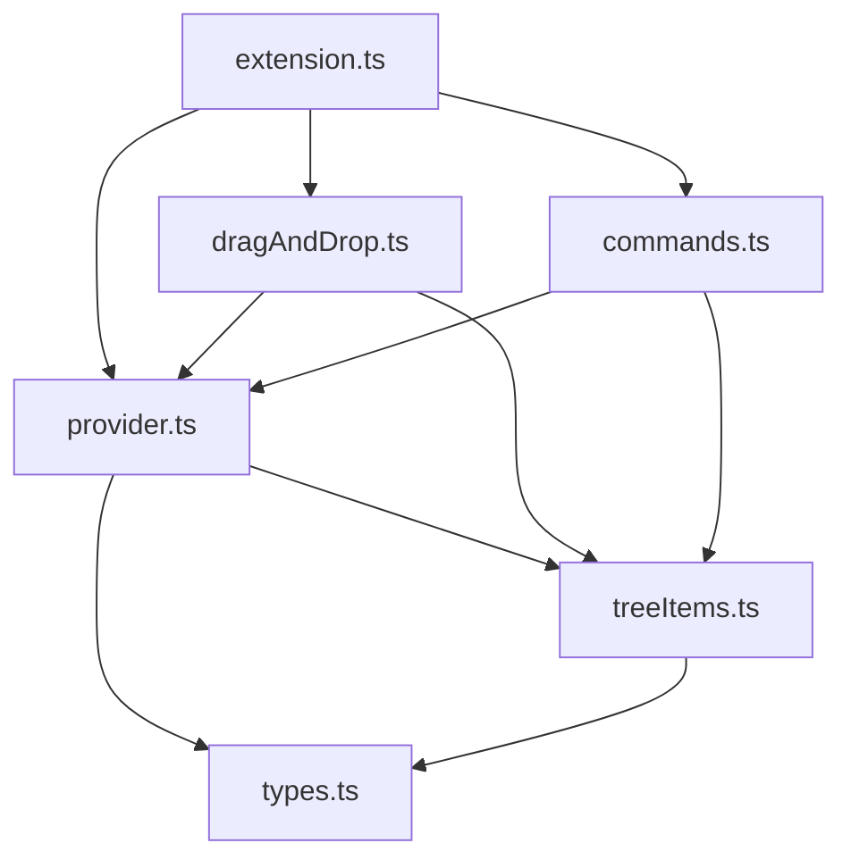
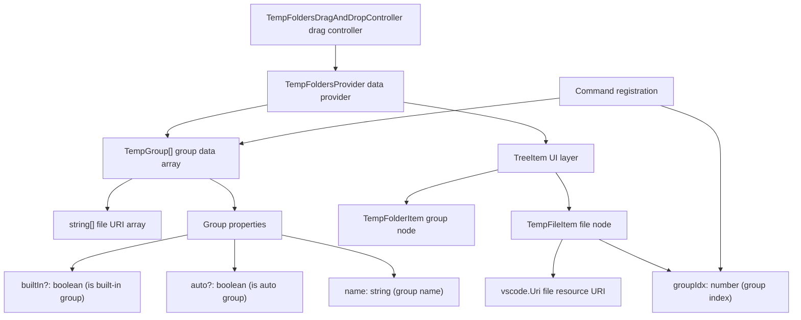

# VirtualTabs Development Guide

This document provides a complete guide for setting up the development environment and workflow for the VirtualTabs VS Code extension.

---

## 🛠️ Environment Setup

### System Requirements

* **Node.js** (Recommended v16 or above)
* **VS Code** (v1.75.0 or above)
* **TypeScript** (included in devDependencies)

### Setup Steps

#### 1. Project Initialization

```bash
# Clone the project and enter the directory
git clone https://github.com/winterdrive/virtual-tabs.git
cd virtual-tabs

# Install dependencies
npm install
```

#### 2. Compile TypeScript

```bash
# One-time compilation
npx tsc

# Or use npm script
npm run vscode:prepublish
```

#### 3. Start Development Mode

There are two ways to start development mode:

##### Method A: Use VS Code Debugging

1. Open the project folder in VS Code
2. Press `F5` or use the Command Palette (`Cmd+Shift+P` / `Ctrl+Shift+P`)
3. Select "Debug: Start Debugging"
4. A new Extension Development Host window will open

##### Method B: Use Command Line

```bash
# macOS/Linux
code --extensionDevelopmentPath=. --new-window

# Windows
code.cmd --extensionDevelopmentPath=. --new-window
```

#### 4. Live Development & Debugging

##### Start TypeScript Watch Mode

```bash
# Start TypeScript watch mode for auto-compilation
npx tsc --watch

# Or use VS Code tasks
# Press Cmd+Shift+P → "Tasks: Run Task" → "tsc: watch - tsconfig.json"
```

#### Reload the Extension

In the Extension Development Host window:

* Press `Cmd+R` (macOS) or `Ctrl+R` (Windows/Linux) to reload
* Or use Command Palette → "Developer: Reload Window"

#### 5. Debugging Tips

### Set Breakpoints

* Set breakpoints directly in TypeScript source code
* Breakpoints will be active after starting debug mode with F5

### View Debug Information

* Use `console.log()` to output to the Developer Console
* Check the Output panel → "Extension Host" channel
* Use VS Code's Debug Console

### Test Extension Features

1. Open some files in the Extension Development Host window
2. Check the "Virtual Tabs" view in the Explorer panel
3. Test various features (grouping, drag-and-drop, context menu, etc.)

---

## 🛠️ Technical Configuration Details

### package.json Core Configuration

```json
{
    "name": "virtual-tabs",
    "displayName": "VirtualTabs",
    "main": "./dist/extension.js",
    "engines": { "vscode": "^1.75.0" },
    "contributes": {
        "views": {
            "explorer": [{
                "id": "virtualTabsView",
                "name": "Virtual Tabs",
                "icon": "$(tab)"
            }]
        },
        "commands": [
            // 21 registered commands, including group management, file operations, batch processing, etc.
        ],
        "menus": {
            "view/item/context": [
                // Rich context menu configuration, supports conditional display by contextValue
            ]
        }
    }
}
```

### TypeScript Compilation Configuration

```json
{
    "compilerOptions": {
        "target": "ES2020",
        "module": "commonjs",
        "outDir": "dist",
        "rootDir": "src",
        "strict": true,
        "types": ["node", "vscode"]
    }
}
```

### VS Code Development Environment Configuration

#### .vscode/launch.json

```json
{
    "configurations": [{
        "name": "Run Extension",
        "type": "extensionHost",
        "preLaunchTask": "vscode:prepublish",
        "outFiles": ["${workspaceFolder}/dist/**/*.js"]
    }]
}
```

#### .vscode/tasks.json

```json
{
    "tasks": [{
        "label": "vscode:prepublish",
        "command": "npm run vscode:prepublish",
        "group": { "kind": "build", "isDefault": true },
        "problemMatcher": ["$tsc"]
    }]
}
```

---

## 📁 Project Structure

### Directory Overview

```text
virtual-tabs/
├── .vscode/               # VS Code config files
│   ├── launch.json       # Debug configuration (preLaunchTask: vscode:prepublish)
│   └── tasks.json        # Build task configuration
├── dist/                 # TypeScript build output
├── assets/               # Icons and screenshots
│   ├── demo.png         # Feature demo screenshot
│   └── virtualtabs_icon_*.png  # Extension icons
├── src/                  # TypeScript source code
│   ├── extension.ts      # Extension entry (activate/deactivate)
│   ├── types.ts          # Data structure definitions (TempGroup)
│   ├── treeItems.ts      # TreeView item definitions (TempFolderItem/TempFileItem)
│   ├── provider.ts       # TreeDataProvider implementation and group management logic
│   ├── dragAndDrop.ts    # Drag-and-drop controller (TreeDragAndDropController)
│   ├── commands.ts       # VS Code command registration and implementation
│   └── index.ts          # Module export entry
├── package.json          # Extension description, commands, and menu configuration
├── tsconfig.json         # TypeScript config
├── readme.md             # Usage and development guide
├── DEVELOPMENT.md        # Detailed development guide
└── LICENSE               # MIT License
```

### Module Responsibilities

| Module File         | Description                                      | Main Class/Interface |
| ------------------- | ------------------------------------------------ | -------------------- |
| `extension.ts`      | Extension lifecycle management, initializes provider, drag-and-drop controller, and command registration | `activate()`, `deactivate()` |
| `provider.ts`       | Implements `TreeDataProvider`, manages group data, file operations, and UI updates | `TempFoldersProvider` |
| `treeItems.ts`      | Defines TreeView item classes, controls display behavior and contextValue | `TempFolderItem`, `TempFileItem` |
| `types.ts`          | Defines shared data structures and interfaces    | `TempGroup` |
| `dragAndDrop.ts`    | Implements drag-and-drop controller, handles file drag to group | `TempFoldersDragAndDropController` |
| `commands.ts`       | Registers and implements all VS Code commands, including group and file management | `registerCommands()` |

### Core Data Flow

```mermaid
flowchart TD
    Extension Startup --> Initialize Provider
    Initialize Provider --> Load workspaceState
    Load workspaceState --> Create Built-in Group
    Create Built-in Group --> Register TreeView
    Register TreeView --> Register Drag-and-Drop Controller
    Register Drag-and-Drop Controller --> Register Commands
    User Actions --> Command Execution
    Command Execution --> Update Group Data
    Update Group Data --> Save workspaceState
    Save workspaceState --> Trigger UI Refresh
```

---

## 🔧 Common Development Issues

### Q: Compile error "Cannot find module 'vscode'"

```bash
# Make sure the correct @types/vscode version is installed
npm install --save-dev @types/vscode@^1.75.0
```

### Q: Extension does not appear in Extension Development Host

* Check if the `main` field in `package.json` points to the correct build file
* Ensure TypeScript compiles without errors
* Check Developer Tools Console for errors

### Q: Code changes are not reflected

* Make sure TypeScript has recompiled (check the `dist/` folder)
* Reload the window in Extension Development Host (`Cmd+R`)

### Q: Drag-and-drop does not work

* Ensure `dragAndDropController` is properly registered to TreeView
* Check `supportedTypes` and `dropMimeTypes` configuration
* Check Console for drag-and-drop related errors

### Q: Commands do not appear in Command Palette

* Check the `commands` configuration in `package.json`
* Ensure commands are properly registered in `commands.ts`
* Reload Extension Development Host

---

## 🔁 Data Flow & Architecture

### Module Interaction Diagram



### Data Flow Overview

1. `extension.ts` initializes `provider`, drag-and-drop controller, and commands on startup.
2. `provider` loads open files and groups them by extension.
3. User and UI interactions (click, drag, command) update data in `provider`.
4. After group data updates, it is automatically saved to `workspaceState` and triggers UI refresh.

### Data Structure Concept Diagram



### Example Data Structure

Data structure in memory and workspaceState:

```json
const groups: TempGroup[] = [
    {
        name: "Currently Open Files",  // Group name
        files: [
            "file:///c:/project/file1.ts",
            "file:///c:/project/file2.json"
        ],
        builtIn: true  // This is a built-in group
    },
    {
        name: "TypeScript Files",  // Auto-grouped
        files: [
            "file:///c:/project/file1.ts",
            "file:///c:/project/file3.ts"
        ],
        auto: true  // This is an auto group
    },
    {
        name: "My Custom Group",  // User custom group
        files: [
            "file:///c:/project/file1.ts",
            "file:///c:/project/file2.json"
        ]
        // Not built-in or auto
    }
];
```

### UI Layer Conversion

`TempGroup` data is converted to TreeView items for VS Code display:

```typescript
// Group node (corresponds to TempGroup)
new TempFolderItem("TypeScript Files", 1, false)
    ├── new TempFileItem(Uri.file("file1.ts"), 1, false)  // File node, records group index
    └── new TempFileItem(Uri.file("file3.ts"), 1, false)  // File node, records group index
```

**Conversion Flow:**

1. `TempGroup[]` data → `TempFoldersProvider.getChildren()`
2. → `TempFolderItem` (group node) + `TempFileItem[]` (file nodes)
3. → VS Code TreeView display

---

## 🚀 Publishing & Deployment

### Local Testing

1. Ensure TypeScript compiles without errors
2. Test all features in Extension Development Host
3. Check version and dependencies in package.json

### Package Extension

```bash
# Install vsce (Visual Studio Code Extension manager)
npm install -g vsce

# Package as .vsix file
vsce package

# Publish to VS Code Marketplace
vsce publish
```

### Version Management

```bash
# Update version
npm version patch  # Patch version (0.0.1 → 0.0.2)
npm version minor  # Minor version (0.0.1 → 0.1.0)
npm version major  # Major version (0.0.1 → 1.0.0)
```

---

## 🤝 Contribution Guide

### Development Workflow

1. Fork the project and create a feature branch
2. Follow the existing code style and architecture
3. Add appropriate comments and documentation
4. Test new features or fixes
5. Submit a Pull Request

### Code Style

* Use TypeScript strict mode
* Follow existing naming conventions
* Keep comments in Traditional Chinese (per user instruction)
* Use JSDoc comments where appropriate

### Testing Checklist

* [ ] TypeScript compiles without errors
* [ ] All features work in Extension Development Host
* [ ] Drag-and-drop works
* [ ] Context menu works
* [ ] Multi-file selection works
* [ ] Auto grouping works
* [ ] Group management works

---

## 📚 Resources

* [VS Code Extension API](https://code.visualstudio.com/api)
* [VS Code Extension Guidelines](https://code.visualstudio.com/api/references/extension-guidelines)
* [TreeView API Documentation](https://code.visualstudio.com/api/extension-guides/tree-view)
* [Drag and Drop API](https://code.visualstudio.com/api/references/vscode-api#TreeDragAndDropController)
