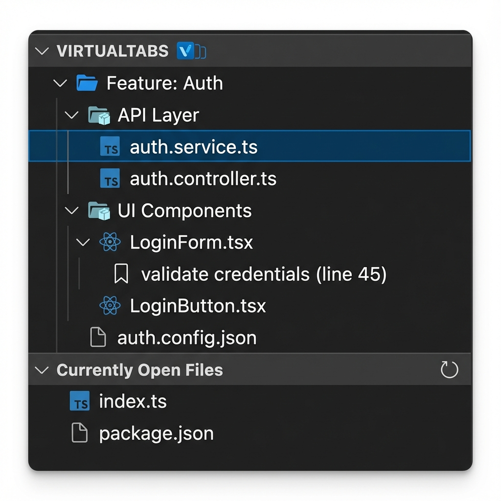
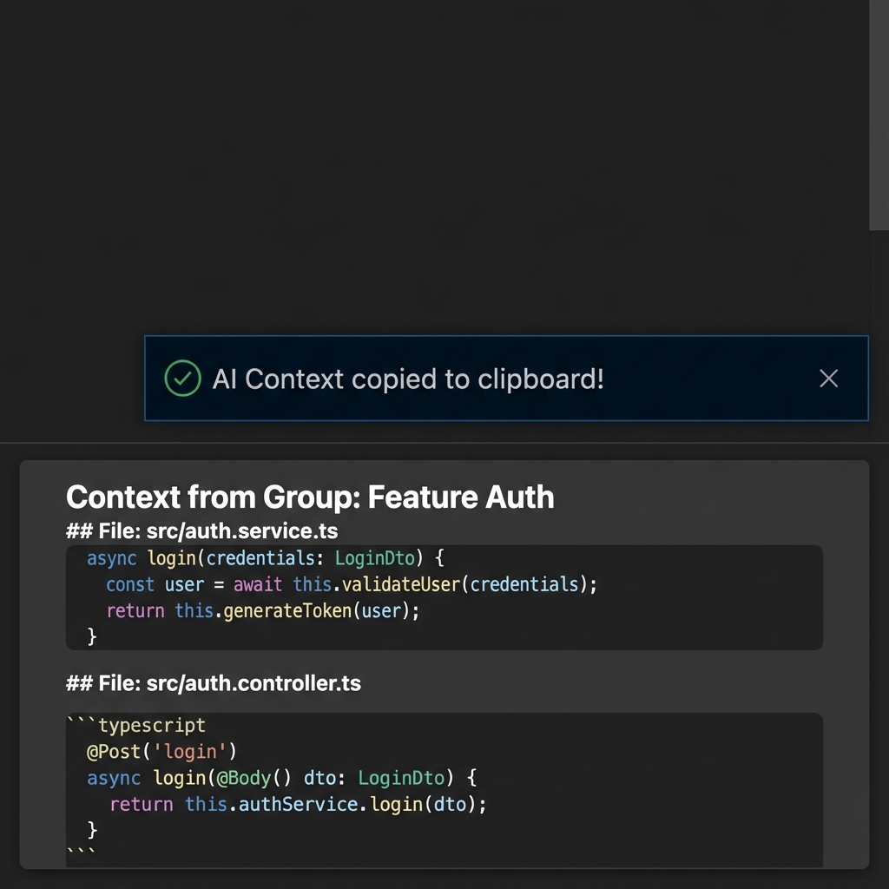
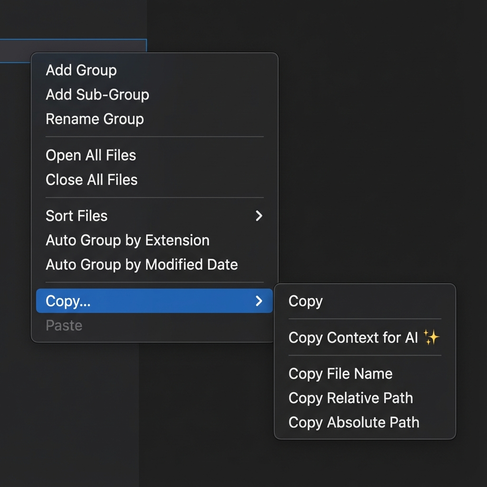
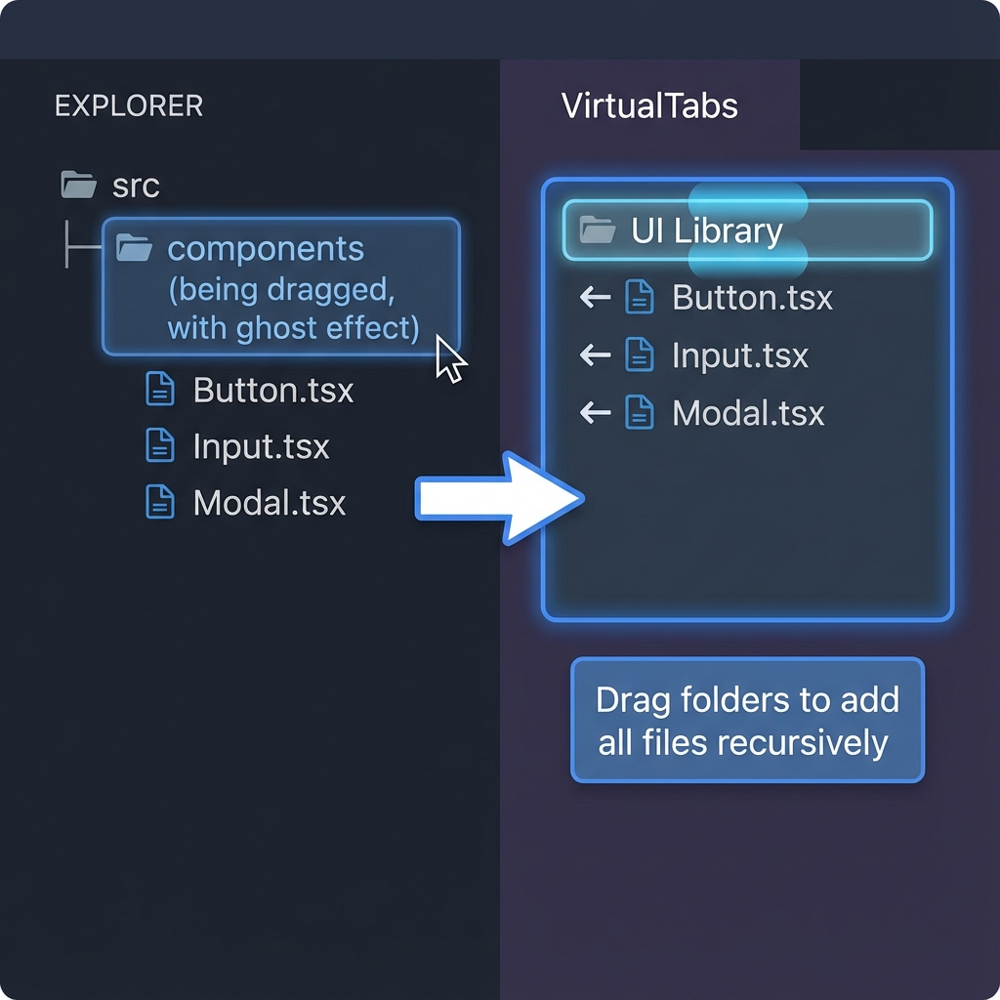

# VirtualTabs 🗂️

> 繁體中文 | **[English](readme.md)**


**突破資料夾限制，自由組織工作流程。建立 AI 就緒的上下文與邏輯檔案群組。**

[](https://marketplace.visualstudio.com/items?itemName=winterdrive.virtual-tabs)
[](https://marketplace.visualstudio.com/items?itemName=winterdrive.virtual-tabs)
[](https://marketplace.visualstudio.com/items?itemName=winterdrive.virtual-tabs)

---

## 🎯 什麼是 VirtualTabs？

VirtualTabs 是一個 VS Code 的**邏輯檔案組織工具**，讓您可以將相關檔案分組在一起，無論它們的實際位置在哪裡。非常適合管理複雜任務和**為 AI 編程助手策劃精確上下文**。

> *「不只是儲存分頁——組織您的工作流程。」*

---

## ✨ 主要功能

### 🆕 v0.3.0 新功能

- **📂 子群組與巢狀結構** — 在群組內建立群組，實現更好的層級組織
- **🤖 AI 上下文匯出** — 一鍵複製所有檔案為 LLM 就緒的上下文
- **📋 智慧複製選單** — 統一的檔案與群組複製選項
- **📁 目錄拖放** — 拖曳資料夾以遞迴加入所有檔案
- **✂️ 複製/貼上/刪除** — VirtualTabs 內完整的剪貼簿操作

### 核心功能

- **📁 跨目錄分組** — 從任何地方組織檔案，突破資料夾限制
- **🔖 任務導向書籤** — 在群組中標記特定程式碼行，快速導航
- **📊 智慧自動分組** — 依副檔名、修改日期或自訂邏輯組織
- **🎨 彈性排序** — 在每個群組內依名稱、路徑、副檔名或修改時間排序
- **🌍 多語言支援** — 完整支援英文、繁體中文和簡體中文

---

## 🆕 v0.3.0 新功能詳解

### 📂 子群組與巢狀結構

建立層級群組結構以獲得更好的組織：



- **新增子群組**：右鍵任何群組 → 「新增子群組」
- **拖曳巢狀**：將群組拖曳到另一個群組上以建立巢狀
- **拖曳至根層級**：拖曳到空白處以解除巢狀
- **遞迴刪除**：刪除父群組會移除所有子群組

### 🤖 AI 上下文匯出

一鍵將檔案群組匯出為 AI 就緒的上下文：



**複製 AI 上下文** 生成格式精美的 markdown：

```text
Context from Group: Feature Auth

## File: src/auth.service.ts
export class AuthService {
  async login(credentials) {
    const user = await this.validateUser(credentials);
    return this.generateToken(user);
  }
}

## File: src/auth.controller.ts
@Post('login')
async login(@Body() dto) {
  return this.authService.login(dto);
}
```

**智慧功能：**

- 自動跳過二進位檔案
- 內容 > 50KB 時在編輯器中開啟
- 顯示大型群組的處理進度
- 遞迴包含所有子群組檔案

### 📋 統一複製選單

所有複製操作集中在一個便捷的子選單中：



| 指令 | 在群組上 | 在檔案上 |
|------|---------|---------|
| **複製 AI 上下文** | 所有檔案（遞迴） | 單一檔案內容 |
| **複製檔名** | 所有檔名 | 單一檔名 |
| **複製相對路徑** | 所有路徑 | 單一路徑 |
| **複製絕對路徑** | 所有路徑 | 單一路徑 |

### 📁 目錄拖放

直接從檔案總管拖曳資料夾以加入所有檔案：



- 自動偵測目錄
- 遞迴加入所有巢狀檔案
- 跳過目錄項目本身

---

## 🚀 快速開始

### 安裝

1. 開啟 VS Code
2. 按 `Ctrl+Shift+X`（或 `Cmd+Shift+X`）
3. 搜尋 **VirtualTabs** 並點擊安裝

### 首次設定

1. 點擊活動列（左側邊欄）中的 **VirtualTabs** 圖示
2. 在面板中右鍵 → **建立新群組**
3. 將檔案拖曳到群組中
4. 右鍵群組 → **依副檔名自動分組**（可選）

### 基本操作

#### 建立群組

- 在 VirtualTabs 面板中右鍵 → **建立新群組**
- 為群組命名（例如「AI 上下文」、「功能：認證」、「Bug 修復 #123」）
- 右鍵任何群組 → **新增子群組** 以進行巢狀組織

#### 加入檔案

- **拖放檔案**：從檔案總管拖曳檔案到群組
- **拖放資料夾**：拖曳資料夾以遞迴加入所有檔案（v0.3.0）
- **多選**：按住 `Ctrl`（或 `Cmd`）點擊檔案，然後一起拖曳
- **目前開啟**：內建群組自動與您開啟的分頁同步

#### 使用書籤（v0.2.0）

1. 在編輯器中任意行右鍵 → **加入書籤到 VirtualTabs**
2. 書籤會顯示在側邊欄的檔案下方
3. 點擊書籤跳轉到該行
4. 右鍵書籤 → **編輯標籤** 或 **編輯描述**

#### AI 上下文匯出（v0.3.0）

1. 右鍵群組 → **複製...** → **複製 AI 上下文**
2. 直接貼到 ChatGPT、Claude 或任何 LLM
3. 所有檔案都以適當的程式碼區塊格式化

#### 排序檔案（v0.1.0）

- 右鍵群組 → **排序檔案** 子選單
- 選擇：名稱、路徑、副檔名或修改時間
- 切換升序/降序
- 每個群組記住自己的排序偏好

---

## 💡 為什麼選擇 VirtualTabs？

### 🧩 解決真實的工作流程問題

在大型專案中，相關檔案散布在各個目錄：

```text
❌ 沒有 VirtualTabs：
├── config.json          (根目錄)
├── styles/theme.css     (樣式資料夾)
├── src/components/      (元件)
└── tests/__tests__/     (測試)

✅ 使用 VirtualTabs：
📁 功能：主題系統
  ├── 📁📚 設定檔
  │   └── config.json
  ├── 📁📚 樣式
  │   └── theme.css
  ├── 📁📚 元件
  │   └── ThemeProvider.tsx
  │     └── 🔖 第 45 行：Context 設定
  └── 📁📚 測試
      └── theme.test.ts
```

### 🤖 完美支援 AI 輔助編程

在 Copilot 和 LLM 時代，**上下文就是王道**：

- **策劃上下文**：只建立包含任務相關檔案的群組
- **一鍵匯出**：將所有檔案複製為 AI 就緒的 markdown（v0.3.0）
- **減少噪音**：透過隔離所需檔案幫助 AI 專注
- **持久提示**：當您返回任務時保持「上下文群組」就緒

> *「VirtualTabs 幫助我精確定義 AI 應該查看的範圍。」*

### 🎯 使用案例

- **跨目錄管理**：將設定、樣式和原始碼組織在一起
- **功能導向開發**：依模組或功能組織
- **AI 上下文策劃**：建立精確的檔案集，一鍵匯出
- **程式碼審查**：集中檔案以提高審查效率
- **教學與參考**：建立策劃的範例，不受資料夾干擾

---

## 📸 功能詳解

### 📁 群組管理

- 建立、刪除、重命名和複製自訂群組
- **子群組** 進行層級組織（v0.3.0）
- 內建 **「目前開啟的檔案」** 群組（自動與 VS Code 分頁同步）
- 拖放檔案到群組內或群組間
- 拖放資料夾以遞迴加入所有檔案（v0.3.0）
- 每個群組獨立且持久化

### 🔖 任務導向書籤（v0.2.0）

- **智慧流程**：右鍵任意行 → 即時建立書籤
- **上下文感知**：書籤綁定到您的群組
- **快速導航**：直接從側邊欄跳轉到特定行
- **智慧標籤**：自動使用行內容或選取內容作為標籤


### 🤖 AI 整合（v0.3.0）

- **複製 AI 上下文**：將所有檔案匯出為 markdown 程式碼區塊
- **智慧二進位偵測**：自動跳過圖片、壓縮檔等
- **大檔案處理**：內容超過 50KB 時在編輯器中開啟
- **遞迴匯出**：包含所有子群組的檔案

### 📊 智慧組織（v0.1.0）

**依副檔名自動分組：**

- 右鍵群組 → **依副檔名自動分組**
- 建立子群組：`.js`、`.css`、`.json` 等

**依日期自動分組：**

- 右鍵群組 → **依修改日期自動分組**
- 建立子群組：今天、昨天、本週、本月、更早

**彈性排序：**

- 排序依據：名稱（A-Z）、路徑、副檔名、修改時間
- 切換升序/降序
- 清除排序以恢復插入順序

### 🛠️ 實用工具

- **複製選單** 提供檔案和群組的統一選項
- 複製檔名、相對路徑或絕對路徑
- 開啟包含資料夾
- 多檔案批次操作（開啟/關閉/移除）
- 群組間複製/貼上檔案（v0.3.0）
- 自動儲存群組狀態（持久化在 `workspaceState`）

---

## 💡 最佳實踐

1. **依任務分組，而非資料夾**：思考您正在做什麼，而非檔案在哪裡
2. **使用子群組**：用巢狀結構組織大型群組（v0.3.0）
3. **用書籤標記邏輯流程**：標記程式碼中的關鍵決策點
4. **建立 AI 上下文群組**：將 5-10 個檔案分組以獲得專注的 AI 協助
5. **提示前先匯出**：在詢問 LLM 前使用「複製 AI 上下文」
6. **定期審查整理**：定期清理未使用的群組以保持組織

---

## 🌍 語言支援

VirtualTabs 根據您的 VS Code 語言設定自動切換：

- 🇺🇸 英文 (`en`)
- 🇹🇼 繁體中文 (`zh-tw`)
- 🇨🇳 簡體中文 (`zh-cn`)

更改您的 VS Code 語言設定即可立即切換語言。

---

## ❓ 常見問題

### Q1：我看不到 VirtualTabs 面板？

**檢查：**

- 擴充功能已啟用
- 您的 VS Code 版本是 1.75+
- VirtualTabs 在活動列（左側邊欄）有自己的圖示

### Q2：如何建立子群組？

右鍵任何群組 → **新增子群組**。您也可以將群組拖曳到另一個群組上以進行巢狀。

### Q3：「複製 AI 上下文」如何運作？

它會讀取群組中的所有檔案（包括子群組），將它們格式化為 markdown 程式碼區塊，然後複製到剪貼簿。二進位檔案會自動跳過。

### Q4：可以與團隊分享群組嗎？

目前，群組儲存在 `workspaceState`（您電腦的本地）。我們正在探索未來版本的工作區層級持久化。

### Q5：書籤在檔案重命名後還能用嗎？

可以！書籤追蹤檔案路徑，如果您在 VS Code 內重命名檔案，它們會更新。

### Q6：如何將資料夾拖曳到群組中？

只需從檔案總管面板將資料夾拖曳到群組上。VirtualTabs 會自動遞迴加入所有檔案，跳過目錄項目本身。

---

## 🔧 開發者專區

有興趣貢獻嗎？查看 **[DEVELOPMENT.md](./DEVELOPMENT.md)**：

- 環境設定
- 除錯與發布指南
- 模組結構與資料流程圖
- 常見錯誤排除

---

## 🤝 貢獻

我們歡迎社群貢獻：

- 🐞 **Bug 回報** → [GitHub Issues](https://github.com/winterdrive/virtual-tabs/issues)
- ✨ **功能建議** 和 UI 建議
- 🔧 **程式碼貢獻**（fork 並提交 PR）
- 🌍 **翻譯** 新語言

---

## 🤝 推薦搭配

### 🔥 Quick Prompt

**VirtualTabs 的完美夥伴。**

**VirtualTabs** 組織您的**上下文**（檔案），**Quick Prompt** 組織您的**指示**（提示）。

- **VirtualTabs**：定義 AI 應該*看哪裡*（檔案群組）
- **Quick Prompt**：定義 AI 應該*做什麼*（提示管理）

兩者結合，創造終極 AI 編程工作流程。

[**了解更多關於 Quick Prompt**](https://github.com/winterdrive/QuickPrompt)

---

## 📅 更新日誌

### ✅ v0.3.0（最新）

- ✅ 子群組與巢狀結構
- ✅ AI 上下文匯出（「複製 AI 上下文」）
- ✅ 統一複製選單與智慧行為
- ✅ 目錄拖放（遞迴加入檔案）
- ✅ 複製/貼上/刪除操作
- ✅ 多選刪除群組和檔案
- ✅ 增強拖放與書籤保留

### ✅ v0.2.0

- ✅ 任務導向書籤與智慧流程
- ✅ 增強的書籤和檔案樹狀視圖
- ✅ 編輯書籤標籤和描述

### ✅ v0.1.0

- ✅ 檔案排序（名稱、路徑、副檔名、修改時間）
- ✅ 依修改日期自動分組
- ✅ 每群組排序偏好
- ✅ 完整 i18n 支援（EN、ZH-TW、ZH-CN）

---

## 📄 授權

採用 **MIT 授權**。個人和商業使用皆免費。

---

**更聰明地組織，更快速地編程。** 🚀
