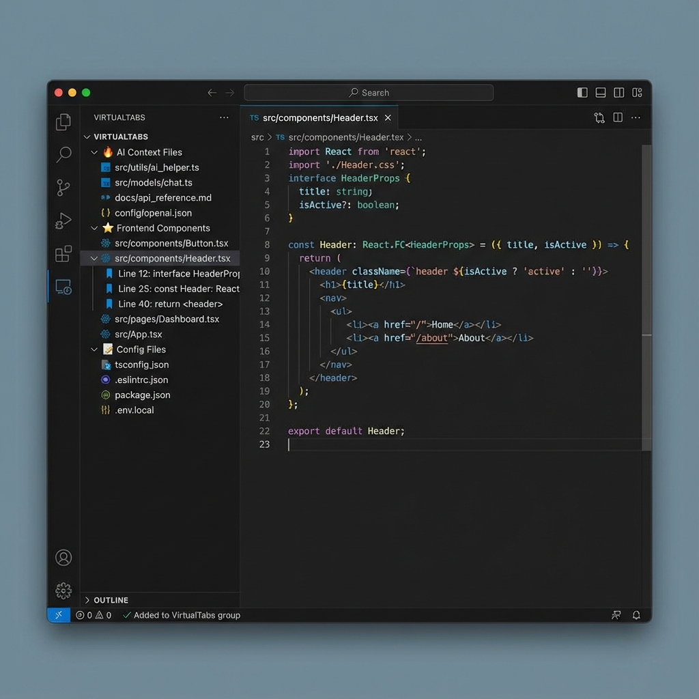
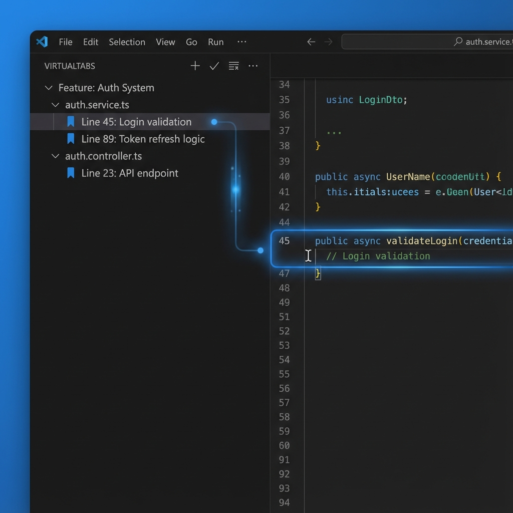

# VirtualTabs 🗂️

> **[繁體中文](README.zh-TW.md)** | English


**Organize your workflow beyond folder limitations. Build AI-ready contexts and logical file groups.**

[](https://marketplace.visualstudio.com/items?itemName=winterdrive.virtual-tabs)
[](https://marketplace.visualstudio.com/items?itemName=winterdrive.virtual-tabs)
[](https://marketplace.visualstudio.com/items?itemName=winterdrive.virtual-tabs)

---

## 🎯 What is VirtualTabs?

VirtualTabs is a **logical file organizer** for VS Code that lets you group related files regardless of their physical location. Perfect for managing complex tasks and **curating precise context for AI coding assistants**.

> *"Don't just save tabs—organize your workflow."*



---

## ✨ Key Features

- **📁 Cross-Directory Grouping** — Organize files from anywhere, breaking free from folder constraints
- **🔖 Task-Oriented Bookmarks** — Mark specific lines of code within your groups for quick navigation
- **📊 Smart Auto-Grouping** — Organize by extension, modification date, or custom logic
- **🎨 Flexible Sorting** — Sort by name, path, extension, or modified time within each group
- **🤖 AI Context Ready** — Create precise file sets for LLMs and AI assistants
- **🌍 Multilingual** — Full support for English, Traditional Chinese, and Simplified Chinese



---

## 🚀 Quick Start

### Installation

1. Open VS Code
2. Press `Ctrl+Shift+X` (or `Cmd+Shift+X`)
3. Search for **VirtualTabs** and click Install

### First Time Setup

1. Click the **VirtualTabs** icon in the Activity Bar (left sidebar)
2. Right-click in the panel → **Create New Group**
3. Drag files into your group
4. Right-click the group → **Auto Group by Extension** (optional)

### Basic Operations

#### Creating Groups

- Right-click in the VirtualTabs panel → **Create New Group**
- Name your group (e.g., "AI Context", "Feature: Auth", "Bug Fix #123")

#### Adding Files

- **Drag & Drop**: Drag files from Explorer into a group
- **Multi-select**: Hold `Ctrl` (or `Cmd`) and click files, then drag together
- **Currently Open**: The built-in group auto-syncs with your open tabs

#### Using Bookmarks (v0.2.0)

1. Right-click any line in the editor → **Add Bookmark to VirtualTabs**
2. The bookmark appears under the file in the sidebar
3. Click the bookmark to jump to that exact line
4. Right-click the bookmark → **Edit Label** or **Edit Description**

#### Sorting Files (v0.1.0)

- Right-click a group → **Sort Files** submenu
- Choose: Name, Path, Extension, or Modified Time
- Toggle ascending/descending order
- Each group remembers its own sort preference

---

## 💡 Why Choose VirtualTabs?

### 🧩 Solves Real Workflow Problems

In large projects, related files are scattered across directories:

```
❌ Without VirtualTabs:
├── config.json          (root)
├── styles/theme.css     (styles folder)
├── src/components/      (components)
└── tests/__tests__/     (tests)
```

```
✅ With VirtualTabs:
📁 Feature: Theme System
  ├── config.json
  ├── styles/theme.css
  ├── src/components/ThemeProvider.tsx
  └── tests/__tests__/theme.test.ts
    └── 🔖 Line 45: Critical test case
```

### 🤖 Perfect for AI-Assisted Coding

**Context is King** in the era of Copilot and LLMs:

- **Curated Context**: Create groups with *only* the relevant files for a task
- **Reduced Noise**: Help AI focus by isolating the exact files needed
- **Persistent Prompts**: Keep a "Context Group" ready when you return to a task

> *"VirtualTabs helps me define the exact boundary of what the AI should look at."*

### 🎯 Use Cases

- **Cross-directory management**: Group config, styles, and source code together
- **Feature-based development**: Organize by module or functionality
- **AI Context Curation**: Build precise file sets for LLMs
- **Code Review**: Centralize files for review efficiency
- **Teaching & Reference**: Create curated examples without folder interference

---

## 📸 Features in Detail

### 📁 Group Management

- Create, delete, rename, and duplicate custom groups
- Built-in **"Currently Open Files"** group (auto-syncs with VS Code tabs)
- Drag and drop files into or between groups
- Each group is independent and persistent

### 🔖 Task-Oriented Bookmarks (v0.2.0)

- **Smart Flow**: Right-click any line → instant bookmark creation
- **Context-Aware**: Bookmarks are tied to your groups
- **Quick Navigation**: Jump to specific lines directly from the sidebar
- **Smart Labeling**: Auto-uses line content or selection as label

### 📊 Smart Organization (v0.1.0)

**Auto-Group by Extension:**

- Right-click group → **Auto Group by Extension**
- Creates sub-groups: `.js`, `.css`, `.json`, etc.

**Auto-Group by Date:**

- Right-click group → **Auto Group by Modified Date**
- Creates sub-groups: Today, Yesterday, This Week, This Month, Older

**Flexible Sorting:**

- Sort by: Name (A-Z), Path, Extension, Modified Time
- Toggle ascending/descending
- Clear sorting to restore insertion order

### 🛠️ Utilities

- Copy filename, relative path, or absolute path
- Open containing folder
- Multi-file batch operations (open/close/remove)
- Auto-save group state (persisted in `workspaceState`)

---

## 💡 Best Practices

1. **Group by Task, Not Folder**: Think about what you're working on, not where files live
2. **Use Bookmarks for Logic Flow**: Mark key decision points in your code
3. **Create AI Context Groups**: Group 5-10 files for focused AI assistance
4. **Version Control**: Share groups with your team (if using workspace settings)
5. **Review and Refine**: Periodically clean up unused groups to stay organized

---

## 🌍 Language Support

VirtualTabs automatically switches based on your VS Code locale:

- 🇺🇸 English (`en`)
- 🇹🇼 Traditional Chinese (`zh-tw`)
- 🇨🇳 Simplified Chinese (`zh-cn`)

Change your VS Code locale to switch languages instantly.

---

## ❓ FAQ

### Q1: I don't see the VirtualTabs panel?

**Check:**

- The extension is enabled
- Your VS Code version is 1.75+
- VirtualTabs has its own icon in the Activity Bar (left sidebar)

### Q2: How does Auto Group by Extension work?

1. Select a group to activate it
2. Right-click → **Auto Group by Extension**
3. Sub-groups are created based on file extensions (e.g., `.js`, `.css`)

### Q3: Can I share my groups with my team?

Currently, groups are saved in `workspaceState` (local to your machine). We're exploring workspace-level persistence in future versions.

### Q4: Do bookmarks work across file renames?

Yes! Bookmarks track file paths and will update if you rename files within VS Code.

---

## 🔧 Developer Section

Interested in contributing? Check out **[DEVELOPMENT.md](./DEVELOPMENT.md)** for:

- Environment setup
- Debugging & publishing guide
- Module structure & data flow diagrams
- Common error troubleshooting

---

## 🤝 Contributing

We welcome community contributions:

- 🐞 **Bug Reports** → [GitHub Issues](https://github.com/winterdrive/virtual-tabs/issues)
- ✨ **Feature Requests** and UI suggestions
- 🔧 **Code Contributions** (fork and submit a PR)
- 🌍 **Translations** for new languages

---

## 📅 Changelog

### ✅ v0.2.0 (Latest)

- ✅ Task-Oriented Bookmarks with smart flow
- ✅ Enhanced tree view for bookmarks and files
- ✅ Edit bookmark labels and descriptions

### ✅ v0.1.0

- ✅ File sorting (name, path, extension, modified time)
- ✅ Auto-group by modification date
- ✅ Per-group sort preferences
- ✅ Full i18n support (EN, ZH-TW, ZH-CN)

---

## 📄 License

Licensed under **MIT License**. Free for personal and commercial use.

---

**Organize smarter, code faster.** 🚀
