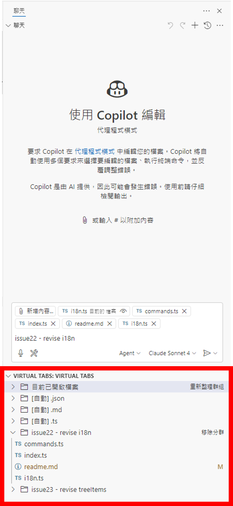

# VirtualTabs – Organize Open Files into Smart Groups

> **Group your open files by custom rules or file extensions to keep your VS Code workspace organized.**

## 🔍 Project Overview

**VirtualTabs** is a simple and practical VS Code extension that provides file grouping management, helping you organize and switch between files more efficiently in multi-file development environments. Through the "Virtual Tabs" TreeView in the sidebar, it supports auto-grouping, custom group management, drag-and-drop, and advanced batch operations for multiple files.

---

## ✨ Main Features

### 🌍 Multi-language Support

* 🈳 **Full Internationalization**: Supports Traditional Chinese, Simplified Chinese, and English
* 🔄 **Automatic Language Detection**: Switches UI language based on VS Code locale
* 🛠️ **Extensible Architecture**: Community contributions for more languages are welcome

### 🗂️ Group Management

* 📁 **Built-in "Currently Open Files" Group**: Automatically syncs with VS Code's open/close file state
* 🆕 **Custom Group Creation**: Add, delete, rename, and duplicate custom groups
* 🔄 **Group Duplication**: Duplicate both built-in and custom groups
* ⚡ **Auto Group by Extension**: Automatically group files by extension within a selected group

### 🌲 TreeView Interactive UI

* 🖱️ **Multi-file Selection**: Select multiple files for batch operations
* 🖱️ **Drag Files to Groups**: Drag files from outside or between groups for organization
* 🗑️ **Flexible File Removal**: Remove files via trash icon or context menu
* 🖱️ **Smart Click Behavior**: Single-click selects file items only, preventing accidental opening

### 📂 Batch File Operations

* 🔓 **Batch Open/Close**: Open or close all files in a group with one click
* 🗂️ **Multi-file Management**: Batch open, close, or remove selected files
* 🎯 **Cross-group File Movement**: Move files between groups via multi-select and drag-and-drop

### 📋 Handy Utilities

* 📄 **Copy File Name**: Quickly copy file names to clipboard
* 📁 **Copy Relative Path**: Copy file path relative to workspace
* 📍 **Copy Absolute Path**: Copy full system path of a file
* 🔍 **File Explorer Integration**: "Show in File Explorer" feature

### UI Example

> 

---

## ⚠️ Notes

* Only the "Currently Open Files" group auto-syncs with VS Code's open/close state
* Other custom groups require manual or drag-and-drop file management
* Auto group by extension requires a specific group to be selected first
* Built-in group does not support "one-click open/close" (since files are already open)

---

## ⚙️ Installation & Usage

### 📦 Install from VS Code Marketplace

1. Open VS Code
2. Go to Extensions panel (`Ctrl+Shift+X` or `Cmd+Shift+X`)
3. Search for "VirtualTabs"
4. Click Install

### 🎯 Basic Usage

1. **View Groups**: Find the "Virtual Tabs" view in the Explorer sidebar
2. **Add Group**: Right-click an existing group → Select "Add Group"
3. **Add Files**: Drag files from File Explorer into a group
4. **Batch Operations**: Use `Ctrl`/`Cmd` to multi-select files for batch actions
5. **Auto Grouping**: Right-click a group and select "Auto Group by Extension"
6. **Switch Language**: Change the "locale" setting in VS Code to switch UI language

### 🌍 Language Settings

VirtualTabs supports the following languages:

* **English** (`en`)
* **Traditional Chinese** (`zh-tw`)
* **Simplified Chinese** (`zh-cn`)

**How to switch language:**
1. Open VS Code settings (`Cmd+,` or `Ctrl+,`)
2. Search for "locale"
3. Choose your desired language code
4. Reload VS Code

For detailed internationalization instructions, see **[I18N Guide (I18N.md)](./I18N.md)**.

### 🧑‍💻 For Developers

If you want to contribute or develop the extension, see **[Development Guide (DEVELOPMENT.md)](./DEVELOPMENT.md)**, which includes:

* Complete environment setup steps
* Debugging configuration and tips
* Project structure and module overview
* Data flow diagrams
* Common development troubleshooting
* Publishing and deployment process

---

## ❓ FAQ

### Why can't I see the "Virtual Tabs" view?

Please check:

1. The extension is properly installed and enabled
2. The "Virtual Tabs" section appears in the Explorer sidebar
3. In development mode, press `F5` to launch Extension Development Host

### How do I perform batch file operations?

1. **Multi-select files**: Hold `Ctrl` (Windows/Linux) or `Cmd` (macOS) and click multiple files
2. **Right-click actions**: Right-click selected files and choose the desired operation
3. **Supported actions**: Open, close, or remove selected files from group

### How does auto group by extension work?

1. Select a group containing files (click the group name)
2. Right-click and choose "Auto Group by Extension"
3. The system will create multiple "[Auto] .extension" groups based on file extensions in the selected group

### How do I remove a single file from a group?

For custom groups:

1. **Trash icon**: Click the trash icon next to the file item
2. **Context menu**: Right-click the file item and select "Remove from Group"

Note: The built-in group "Currently Open Files" does not support removing individual files.

### What if drag-and-drop doesn't work?

Check the following:

1. The target must be a group (folder icon), not a file
2. Dragging files from File Explorer into a group is supported
3. Dragging files between groups is supported
4. Make sure your VS Code version meets the requirement (^1.75.0)

### Are group data saved?

Yes, group data are automatically saved in:

* VS Code's `workspaceState`
* Automatically saved after each operation
* Automatically loaded when reopening the workspace

---

## 🔧 Roadmap

* 🧩 Custom grouping rules (by path/keyword/regex, etc.)
* ⚙️ Settings UI: Visual configuration for grouping logic
* 🔁 Save/restore grouping settings

---

## 🤝 How to Contribute

We welcome community contributions! Ways to participate:

### 🐛 Report Issues

* Go to [GitHub Issues](https://github.com/winterdrive/virtual-tabs/issues)
* Provide detailed error description and reproduction steps
* Include your VS Code version and OS info

### ✨ Feature Suggestions

* Mark as `enhancement` in Issues
* Describe your feature request and use case
* UI/UX suggestions are welcome

### 🔧 Code Contributions

1. Fork the project and create a feature branch
2. Follow the existing code style (TypeScript + Traditional Chinese comments)
3. Ensure TypeScript compiles without errors
4. Test features in Extension Development Host
5. Submit a Pull Request with detailed description

### 📖 Documentation Improvements

* Report unclear or incorrect documentation
* Add usage examples and best practices
* Translate docs into other languages

For detailed development guide, see **[DEVELOPMENT.md](./DEVELOPMENT.md)**.

---

## 📄 License

This project is licensed under the MIT License. You are free to:

* ✅ Use commercially
* ✅ Modify the code
* ✅ Distribute and re-publish
* ✅ Use privately

You must retain the original license notice. See [LICENSE](./LICENSE) for details.

---
