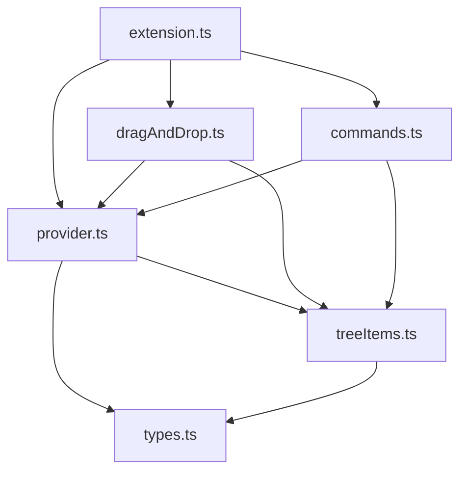

# VirtualTabs – Organize Open Files into Smart Groups

> **自定義或以副檔名分群開啟中的檔案，讓 VS Code 編輯環境井然有序。**

> 原專案名稱：Tab Grouper（已全面升級為 VirtualTabs）

## 🔍 專案簡介

**VirtualTabs** 是一款簡潔實用的 VS Code 擴充套件，可自動將所有**目前開啟的檔案依副檔名分群**，並在側邊欄新增「Virtual Tabs」TreeView 介面。適合多檔案編輯、切換頻繁的開發工作流程，幫助你更快速定位檔案、減少認知負擔。

---

## ✨ 主要功能

* 📁 **副檔名自動分群**：自動依據副檔名（如 `.ts`, `.json`）建立群組。
* 🌲 **TreeView 顯示介面**：於側邊欄 Explorer 中新增「Virtual Tabs」視圖。
* 🖱️ **可點選快速開檔**：點擊節點即可切換至對應檔案。
* 🔄 **即時同步**：開啟、關閉檔案時自動更新群組列表。

### UI 範例圖

> 

### 分群結構示意

```mermaid
flowchart TD
    "Virtual Tabs" --> "ts"
    "Virtual Tabs" --> "json"
    "ts" --> "extension.ts"
    "ts" --> "provider.ts"
    "json" --> "package.json"
    "json" --> "tsconfig.json"
```

---

## ⚙️ 安裝與使用

### 1. 安裝依賴

```bash
npm install
```

### 2. 編譯原始碼

```bash
npm run vscode:prepublish
```

### 3. 啟動 Extension Host

於 VS Code 按下 `F5`，開啟開發者模式，側邊欄將出現「Virtual Tabs」視圖。

---

## 🧩 檔案結構與模組設計

### 目錄總覽

```text
editorGrouper/
├── package.json           # 擴充套件描述與註冊點
├── tsconfig.json          # TypeScript 編譯設定
├── readme.md              # 使用與開發說明
├── architecture.md        # 架構文件
└── src/
    ├── extension.ts       # 擴充套件主程式
    ├── types.ts           # 資料結構定義
    ├── treeItems.ts       # TreeView 項目定義
    ├── provider.ts        # 分群資料與 TreeView 提供者
    ├── dragAndDrop.ts     # 拖曳控制器
    └── commands.ts        # 指令註冊與邏輯實作
```

### 模組職責說明

| 模組檔案             | 功能簡述                               |
| ---------------- | ---------------------------------- |
| `extension.ts`   | 初始化 provider、D\&D 控制器與指令註冊。        |
| `provider.ts`    | 實作 `TreeDataProvider`，負責群組資料與樹狀結構。 |
| `treeItems.ts`   | 定義 `TreeItem` 類別，控制顯示與互動行為。        |
| `types.ts`       | 定義 `TempGroup` 等共用資料結構。            |
| `dragAndDrop.ts` | 實作拖曳控制邏輯（拖曳檔案至群組）。                 |
| `commands.ts`    | 註冊並處理如新增群組、刪除群組等 VS Code 指令。       |

### 模組互動圖



---

## 🔁 資料流簡介

1. `extension.ts` 啟動時初始化 `provider`、拖曳控制器與指令。
2. `provider` 載入已開啟檔案，依副檔名分群。
3. 使用者與 UI 互動（如點擊、拖曳、指令）將更新 `provider` 中的資料。
4. 群組資料更新後，自動儲存至 `workspaceState` 並觸發 UI 刷新。

---

## 🛠️ 設定與配置

### package.json（重點節錄）

```json
{
  "name": "virtual-tabs",
  "displayName": "Tab Grouper",
  "description": "Group open tabs by file type in a sidebar view",
  "main": "./dist/extension.js",
  "activationEvents": ["*"],
  "contributes": {
    "views": {
      "explorer": [
        {
          "id": "virtualTabsView",
          "name": "Grouped Tabs"
        }
      ]
    }
  }
}
```

### tsconfig.json

```json
{
  "compilerOptions": {
    "target": "ES6",
    "module": "commonjs",
    "outDir": "dist",
    "rootDir": "src",
    "strict": true
  },
  "include": ["src"]
}
```

---

## ❓ 常見問題（FAQ）

### 為什麼沒有看到「Grouped Tabs」視圖？

請確認是否正確啟動 Extension Host（按下 `F5`），並查看左側邊欄的 Explorer 分頁。

### 可以自訂分群邏輯嗎？

目前僅支援依據副檔名自動分群。未來將加入以**資料夾路徑**、**關鍵字**等自訂規則。

---

## 🔧 未來規劃

* 🧩 自訂分群條件（路徑/關鍵字/正則等）
* ⚙️ 設定介面：可視化配置分群邏輯
* 🔁 儲存/還原分群設定

---

## 🤝 貢獻方式

我們歡迎任何形式的貢獻！

* 💬 回報錯誤與需求：請透過 \[GitHub Issues]。
* ✨ 新功能或改善 UI：歡迎提出 Pull Request。
* 📖 文件改進：發現敘述不清歡迎協助修正。

---

## 📄 授權條款

本專案採用 MIT 授權，可自由使用、修改與再發佈。

---
