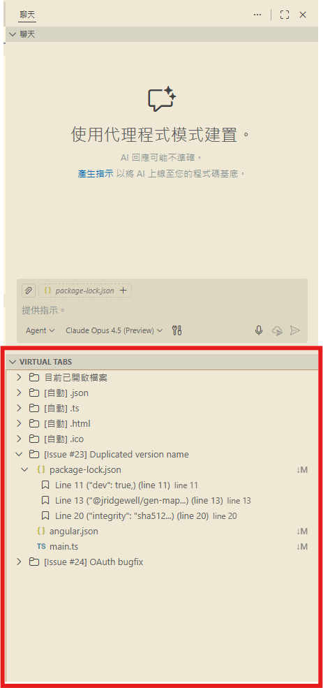

# VirtualTabs – Custom File Grouping Beyond Folder Limitations

> **Don't just save tabs—organize your workflow. Build AI-ready contexts and logical file groups beyond folder limits.**

## 🔍 Project Overview

**VirtualTabs** is more than just a tab manager—it's a **logical file organizer** for VS Code. It enables you to create virtual workspaces for your tasks, allowing you to **sort, categorize, and structure** related files regardless of their physical location.

Whether you're switching between complex tasks or **curating context for AI coding assistants**, VirtualTabs helps you keep your focus sharp and your workspace organized.

## 🎯 Use Cases

* **Cross-directory management**: Group related files scattered across different folders (e.g., config, styles, source code).
* **Feature-based grouping**: Group files by module or functionality for focused development.
* **AI Context Curation**: Create precise file sets to provide clean context for LLMs and AI assistants.
* **Project task switching**: Create quick-access file sets for specific tasks or sprints.
* **Code review**: Centralize files for review to improve efficiency.
* **Teaching & reference**: Build curated examples or materials without folder interference.

---

## ✨ Key Features

### 📁 Group Management

* Add, delete, rename, and duplicate custom groups
* Built-in "Currently Open Files" group auto-syncs with VS Code tabs
* Auto-group files by extension (requires group selection)
* **NEW** Auto-group by modification date (Today, Yesterday, This Week, etc.)
* **NEW** Task-Oriented Bookmarks: Mark specific lines of code within your groups

### 🖱️ User Interface

* Multi-file selection and batch actions (open / close / remove)
* Drag and drop files into or between groups
* Smart click: single-click to select only, avoiding accidental file opening
* Flexible file removal (via icon or context menu)

### 📊 File Organization (v0.1.0)

* **Sort files within groups**:
  * Sort by name (A-Z with natural numeric ordering)
  * Sort by path
  * Sort by file extension
  * Sort by last modified time
  * Toggle ascending/descending order
  * Clear sorting to restore insertion order
* **Smart grouping**: Each group remembers its own sort preference
* **Auto-group by date**: Automatically organize files into time-based categories

### 🔖 Task-Oriented Bookmarks (v0.2.0)

* **Smart Flow**: Right-click any line to add a bookmark instantly. No input boxes, no friction.
* **Context-Aware**: Bookmarks are tied to your VirtualTabs groups, keeping your task context complete.
* **Quick Navigation**: Jump to specific lines of code directly from the VirtualTabs sidebar.
* **Smart Labeling**: Automatically uses line content or selection as the bookmark label.

### 📄 UI Examples

#### Context Management & Bookmarks
>
> *Organize files by task, not folder. Perfect for curating context for AI assistants.*
> *Mark key logic points within your groups. Jump straight to the code that matters.*
>
> 

### 🛠️ Utilities

* Copy filename, relative path, or absolute path
* Open containing folder
* Auto-save group state (saved in `workspaceState`)

### 🌍 Multilingual Support

* Supports Traditional Chinese, Simplified Chinese, and English
* Automatically switches based on VS Code locale
* Community contributions for new languages are welcome

---

## 🚀 Why Choose VirtualTabs?

### 🧩 Solves Common Workflow Issues

In large projects, related files are often scattered:

* Config files → root directory
* Styles → `styles`
* Logic → `src` / `components`
* Tests → `tests` / `__tests__`

With VirtualTabs, you can:

✅ **Create logical groups instantly**

✅ **Sort & Auto-group** files to find what you need (unlike simple tab savers)

✅ **Switch contexts** based on task, not just open files

### 🤖 Perfect for AI-Assisted Coding

In the era of Copilot and LLMs, **Context is King**. VirtualTabs is the ultimate tool for managing AI context:

* **Curated Context**: Instead of dumping your entire repo into an AI chat, create a VirtualTabs group with *only* the relevant files.
* **Reduced Noise**: Help AI focus by isolating the exact files needed for a feature or bug fix.
* **Persistent Prompts**: Keep a "Context Group" for specific ongoing tasks. When you come back to the task, your AI context is ready to go.

> *"VirtualTabs helps me define the exact boundary of what the AI should look at."*

---

## 📦 Installation & Usage

### Installation

1. Open VS Code
2. Press `Ctrl+Shift+X` (or `Cmd+Shift+X`)
3. Search for `VirtualTabs` and install

### Basic Usage

**Creating and Managing Groups:**

* Click the "Virtual Tabs" icon in the Activity Bar to open the view
* Right-click to create a new group
* Drag files into the group
* Right-click group → Auto-group by extension

**Sorting Files (v0.1.0):**

* Right-click a group → "Sort Files" submenu
* Choose sorting method: Name, Path, Extension, or Modified Time
* Use "Toggle Sort Order" to switch between ascending/descending
* Use "Clear Sorting" to restore original insertion order

**Auto-Group by Date (v0.1.0):**

* Right-click a group → "Auto Group by Modified Date"
* Files will be automatically organized into sub-groups:
  * Modified: Today
  * Modified: Yesterday
  * Modified: This Week
  * Modified: Last Week
  * Modified: This Month
  * Modified: Older

**Using Bookmarks (v0.2.0):**

* Right-click any line in the editor → "Add Bookmark to VirtualTabs"
* The bookmark appears under the file in the VirtualTabs sidebar
* Click the bookmark to jump to that exact line
* Right-click the bookmark in the sidebar to Edit Label or Description

* Change VS Code locale to switch language

---

## 🌍 Language Support

Supported languages:

* Traditional Chinese (zh-tw)
* Simplified Chinese (zh-cn)
* English (en)

---

## ❓ FAQ

### Q1: I don’t see the Virtual Tabs view?

Please check:

* The extension is enabled
* Your VS Code version is above 1.75
* VirtualTabs has its own icon in the Activity Bar—look for it on the left

### Q2: How does Auto Group by Extension work?

1. Select a group to activate it
2. Right-click and choose "Auto Group by Extension"
3. The system will create sub-groups based on file extensions (e.g., `.js`, `.css`)

---

## 🔧 Developer Section

Interested in contributing? Check out [DEVELOPMENT.md](./DEVELOPMENT.md), which includes:

* Environment setup
* Debugging & publishing guide
* Module structure & data flow diagrams
* Common error troubleshooting

---

## 🤝 Contributing

We welcome community contributions:

* 🐞 Bug reports → [GitHub Issues](https://github.com/winterdrive/virtual-tabs/issues)
* ✨ Feature requests and UI suggestions
* 🔧 Code contributions (please fork and submit a PR)

---

## 📅 Roadmap

### ✅ v0.2.0 (Released)

* ✅ **Task-Oriented Bookmarks**: Add, edit, and jump to bookmarks within groups
* ✅ **Smart Flow**: Frictionless bookmark creation
* ✅ **Enhanced UI**: Improved tree view for bookmarks and files

### ✅ v0.1.0 (Released)

* ✅ File sorting within groups (name, path, extension, modified time)
* ✅ Auto-group by modification date
* ✅ Per-group sort preferences
* ✅ Full i18n support (EN, ZH-TW, ZH-CN)

---
